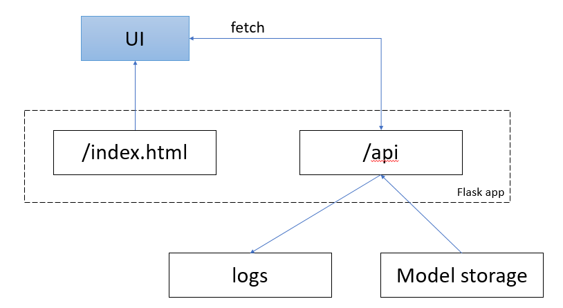

## Housing Price Prediction Model

Лекции и тех задание на семинары доступны на [Я.диске](https://disk.yandex.ru/d/vDb3HPumZ2xK0w)  

Ссылки на свои репо присылайте на ailabintsev@fa.ru  

### Описание проекта
Проект направлен на создание модели машинного обучения для прогнозирования цен на жилье. Модель использует различные характеристики объектов недвижимости для предсказания их рыночной стоимости.

### Структура проекта
```
housing_price_prediction/
├── data/
│   ├── raw/                # Исходные данные
│   ├── processed/          # Обработанные данные
├── models/                 # Обученные модели
├── notebooks/             # Jupyter notebooks
├── src/                   # Исходный код
│   ├── data.py            # Обработка данных
│   ├── models.py          # Модели машинного обучения
│   └── utils.py           # Вспомогательные функции
├── requirements.txt       # Требования к зависимостям
└── README.md
```

### Архитектура сервиса ПА


### Данные
Используемые данные включают следующие характеристики:
* Площадь жилья
* Количество комнат
* Расстояние до центра города
* Год постройки
* Тип здания
* Район
* Инфраструктура
* И другие метрические и категориальные признаки

### Как запустить
1. Клонируйте репозиторий:
```bash
git clone https://github.com/yourusername/housing_price_prediction.git
```

2. Установите зависимости:
```bash
pip install -r requirements.txt
```

3. Запустите Jupyter Notebook:
```bash
jupyter notebook
```

### Модели машинного обучения
* **Linear Regression** - базовая линейная регрессия
* **Random Forest** - ансамбль деревьев решений
* **Gradient Boosting** - градиентный бустинг
* **XGBoost** - экстремальный градиентный бустинг
* **Neural Networks** - нейронные сети

### Метрики оценки
* **Mean Absolute Error (MAE)**
* **Mean Squared Error (MSE)**
* **Root Mean Squared Error (RMSE)**
* **R² Score**

### Результаты
После обучения модели достигаются следующие результаты:
* MAE: ~$2000
* RMSE: ~$2500
* R² Score: ~0.85

### Как использовать модель
1. Загрузите данные в формате CSV
2. Обработайте данные с помощью предобработчиков
3. Загрузите обученную модель
4. Сделайте предсказания

### Команда
* **Data Scientist**: [Имя Фамилия]
* **ML Engineer**: [Имя Фамилия]
* **Product Manager**: [Имя Фамилия]

### Лицензирование
Этот проект распространяется под лицензией MIT. Смотрите файл LICENSE для деталей.

### Контакты
Для вопросов и предложений обращайтесь:
* Email: your.email@example.com
* GitHub: @yourusername
* LinkedIn: linkedin.com/in/yourusername
